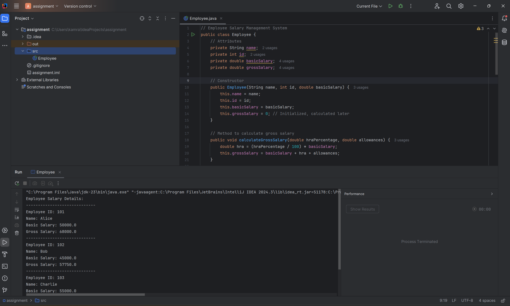
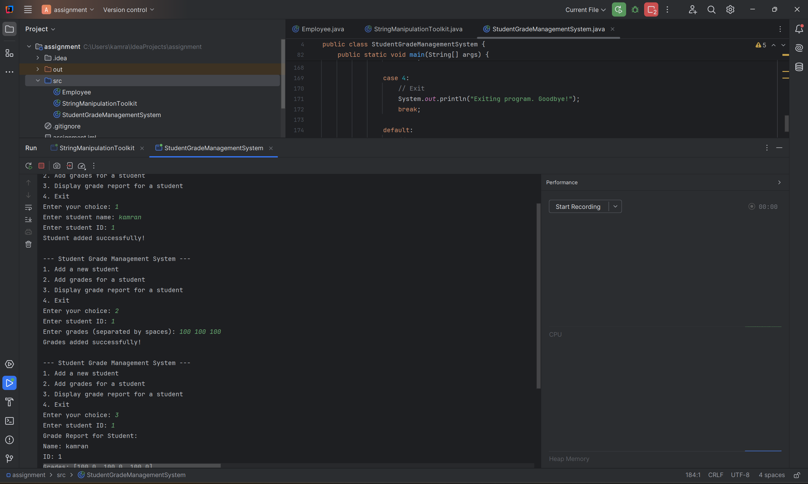

# **CSE Assignments Repository**
A repository for various CSE assignments with explanations, outputs, and code examples.

---

## **Assignments**

### **1. Employee Salary Management System**
**Description**:
- A program to calculate employee salaries.
- Includes gross salary calculation, bonuses, and salary details.

**Output Screenshot**:  


---

### **2. String Manipulation Toolkit**
**Description**:
- A toolkit to reverse strings, check palindromes, convert cases, and count vowels/consonants.

**Output Screenshot**:  


---

### **3. Student Grade Management System**
**Description**:
- Manages student records and calculates average, highest, and lowest grades.

**Output Screenshot**:  


---

### **4. Temperature Converter**
**Description**:
- Converts temperatures between Celsius, Fahrenheit, and Kelvin.
- Includes validation for invalid inputs like negative Kelvin values.

**Output Screenshot**:  


---

### **5. Bank Account Management System**
**Description**:
- Implements deposit, withdrawal, and balance checks.
- Maintains transaction history and handles overdraft errors.

**Output Screenshot**:  


---

### **6. Command-Line Calculator**
**Description**:
- A calculator for evaluating mathematical expressions with operator precedence and parentheses.

**Output Screenshot**:  


---

## **Steps to Run the Code**
1. **Clone the Repository**:
   ```bash
   git clone https://github.com/kamrancodex/CSE-Assignments.git
   cd CSE-Assignments
 Compile and Run the Programs.
